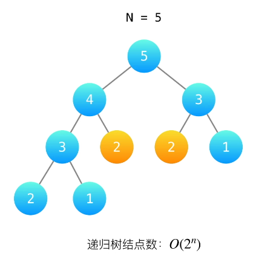

# 爬楼梯问题

## 问题描述
假设你正在爬楼梯。需要 n 阶你才能到达楼顶。

每次你可以爬 1 或 2 个台阶。你有多少种不同的方法可以爬到楼顶呢？

 

示例 1：

输入：n = 2
输出：2
解释：有两种方法可以爬到楼顶。
1. 1 阶 + 1 阶
2. 2 阶

示例 2：

输入：n = 3
输出：3
解释：有三种方法可以爬到楼顶。
1. 1 阶 + 1 阶 + 1 阶
2. 1 阶 + 2 阶
3. 2 阶 + 1 阶

## 递归解法
> 思路：
> n = 1 时，只有一种方法，即爬 1 阶；
> n = 2 时，有两种方法，即爬 1 阶 + 1 阶和 2 阶；
> n = 3 时，若在n=1，则有两种方法，即爬 1 阶 + 1 阶和 2 阶；若在n=2，则只有一种方法，即爬一阶；
> 而n = 1和n = 2结果已知，由此，可以退出递推公式
> 即递推公式为：f(n) = f(n-1) + f(n-2)

### 代码实现
~~~python
def climbStairs(n):
    # 处理边界条件
    if n == 1:
        return 1
    if n == 2:
        return 2
    # 递归调用
    return climbStairs(n-1) + climbStairs(n-2)
~~~
### 复杂度分析
从递归树中可以看出，调用的次数为**2^n^**
所以：时间复杂度：**O(2^n^)** 空间复杂度：**O(n)**

这种方法存在重复计算，递归树中，节点2就被计算了两次，导致效率较低
我们可以引入一个数组，保存计算结果，当遇到相同的参数时，直接返回结果，避免重复计算，于是得到**记忆化递归解法**

## 记忆化递归解法
> 思路：
> 在原有的递归解法中，添加一个数组，保存计算结果，当遇到相同的参数时，直接返回结果，避免重复计算

### 代码实现
~~~python
def climb(n):
    memo = []
    # 初始化数组
    for i in range(n + 1):
        memo.append(0)
    return climbStairsMemo(n, memo)

def climbStairsMemo(n, memo):
    # 计算过的直接返回
    if memo[n] > 0:
        return memo[n]
    
    # 处理边界条件
    if n == 1:
        memo[n] = 1
    elif n == 2:
        memo[n] = 2
    else:
        memo[n] = climbStairsMemo(n-1, memo) + climbStairsMemo(n-2, memo)
    return memo[n]
~~~

### 复杂度分析
由于每个节点只被计算一次，所以共n个节点，计算n次
时间复杂度：**O(n)** 空间复杂度：**O(n)**

## 动态规划解法
> 思路：
> 与递归类似，通过状态转移方程即递推式，计算出结果
> 状态转移方程：f(n) = f(n-1) + f(n-2)

### 代码实现
~~~python
class Solution(object):
    def climbStairs(self, n):
        """
        :type n: int
        :rtype: int
        """
        if n == 1:
            return 1
        # 初始化数组
        dp = []
        for i in range(0, n + 1):
            dp.append(0)
        dp[1] = 1
        dp[2] = 2

        # 状态转移方程递推
        for i in range(3,n + 1):
            dp[i] = dp[i - 1] + dp[i - 2]
        return dp[n]
~~~

### 复杂度分析
时间复杂度：**O(n)** 空间复杂度：**O(n)**
我们可以将数组优化成三个状态量，将空间复杂度降低到常数级别

## 优化动态规划算法

### 代码实现
~~~python
class Solution(object):
    def climbStairs(self, n):
        """
        :type n: int
        :rtype: int
        """
        if n == 1:
            return 1

        # 初始化三个变量
        num1 = 1
        num2 = 2

        # 状态转移方程递推
        for i in range(3,n + 1):
            num3 = num1 + num2
            num1 = num2
            num2 = num3
        
        # num2 为最终状态
        return num2
~~~

### 复杂度分析
时间复杂度：**O(n)** 空间复杂度：**O(1)**

