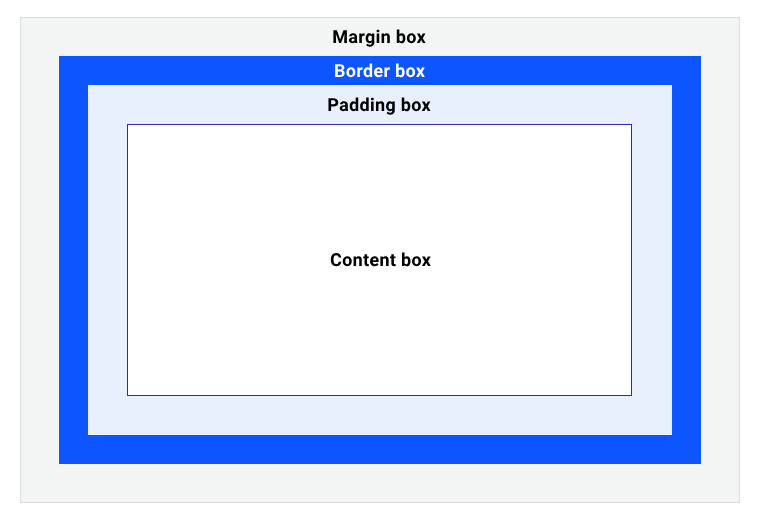

# CSS笔记

## 目录

- [CSS笔记](#css笔记)
  - [目录](#目录)
  - [盒子模型](#盒子模型)
    - [盒子大小](#盒子大小)
    - [外部显示类型](#外部显示类型)
      - [区块盒子](#区块盒子)
      - [行内盒子](#行内盒子)
    - [外边距、内边距和边框](#外边距内边距和边框)
      - [外边距](#外边距)
      - [边框](#边框)
      - [内边距](#内边距)
    - [使用 diplay: inline-block](#使用-diplay-inline-block)
  - [选择器](#选择器)
    - [常见场景](#常见场景)
      - [链接样式](#链接样式)
      - [选择第一个子元素](#选择第一个子元素)
      - [选择段落中的第一行和第一个字](#选择段落中的第一行和第一个字)
      - [隔行选择](#隔行选择)
  - [层叠、优先级与继承](#层叠优先级与继承)
    - [冲突规则](#冲突规则)
      - [层叠](#层叠)
      - [优先级](#优先级)
    - [级联层](#级联层)
      - [基础语法](#基础语法)
      - [级联层的优先级规则](#级联层的优先级规则)
      - [典型应用场景](#典型应用场景)
      - [继承](#继承)
  - [值和单位](#值和单位)
    - [长度](#长度)
    - [颜色](#颜色)
    - [图像](#图像)
    - [位置](#位置)
    - [字符串和标识符](#字符串和标识符)
    - [函数](#函数)
  - [在 css 中调整大小](#在-css-中调整大小)
    - [设置具体的尺寸](#设置具体的尺寸)
      - [使用百分比](#使用百分比)
      - [min 和 max 尺寸](#min-和-max-尺寸)
      - [视口单位](#视口单位)
  - [背景与边框](#背景与边框)
    - [背景样式](#背景样式)
      - [背景颜色](#背景颜色)
      - [背景图像](#背景图像)
    - [边框样式](#边框样式)
  - [溢出的内容](#溢出的内容)
    - [CSS 尽力减少“数据损失”](#css-尽力减少数据损失)
    - [控制溢出的内容](#控制溢出的内容)
      - [overflow属性](#overflow属性)

## 盒子模型
[回到目录](#目录)

* **内容框**是内容所在的区域。内容可以控制**其父级的大小**，因此这通常是大小变化最大的区域。
* **内边距框**围绕着内容框，是由 padding 属性创建的空间。由于内边距位于盒子内部，因此盒子背景在内边距创建的空间中可见。 如果框设置了溢出规则（例如 overflow: auto 或 overflow: scroll），滚动条也会占用此空间。
* **边框**围绕内边距框，其空间由 border 值定义，该值会为元素创建视觉框架。元素的边框边缘是您可以看到的界限。
* **边距框**，即框周围的空间，由框的 margin 规则定义。`outline` 和 `box-shadow` 等属性也会占用此空间，因为它们绘制在元素顶部，不会影响框的大小。更改盒子 200px 中 outline-width 的盒子不会更改边框边缘内的任何内容。

### 盒子大小
[回到上一级](#盒子模型)

* 默认情况下，盒子的 height 属性控制的是 content-box 的高度，盒子的 width 属性控制 content-box 的宽度。即 `box-sizing: content-box;`
* 若希望 height 属性控制的高度即可见区域的高度， width 属性控制的宽度即可见区域宽度，则需要 `box-sizing: border-box;`

~~~css
*,
*::before,
*::after {
  box-sizing: border-box;
}
~~~
* 此 CSS 规则会选择文档中的**每个元素**以及每个 ::before 和 ::after 伪元素，并应用 box-sizing: border-box。这意味着，现在每个元素都使用此替代盒模型
* 由于替代框模型的可预测性更高，因此开发者通常会将此规则添加到**重置和规范化器**中

### 外部显示类型
[回到上一级](#盒子模型)

#### 区块盒子
[回到上一级](#外部显示类型)
* 通过 `display: block;` 设置区块盒子
* 一个拥有 **block 外部显示类型**的盒子会表现出以下行为：

    * 盒子会产生换行。
    * width 和 height 属性可以发挥作用。
    * 内边距、外边距和边框会将其他元素从当前盒子周围“推开”。
    * 如果未指定 width，方框将沿行向扩展，以填充其容器中的可用空间。在大多数情况下，盒子会变得与其容器一样宽，占据可用空间的 100%。

#### 行内盒子
[回到上一级](#外部显示类型)
* 通过 `display: inline;` 设置行内盒子
* 一个拥有 inline 外部显示类型的盒子会表现出以下行为：
    * 盒子不会产生换行。
    * width 和 height 属性将不起作用。
    * 垂直方向的内边距、外边距以及边框会被应用但是不会把其他处于 inline 状态的盒子推开。
    * 水平方向的内边距、外边距以及边框会被应用且会把其他处于 inline 状态的盒子推开。

### 外边距、内边距和边框
[回到上一级](#盒子模型)

#### 外边距
[回到上一级](#外边距内边距和边框)

* 通过 `margin` 属性来设置**各个边的外边距**
~~~css
/* 应用于所有边 */
margin: 1em;
margin: -3px; /* 负值：表现为收缩 */

/* 上边下边 | 左边右边 */
margin: 5% auto;

/* 上边 | 左边右边 | 下边 */
margin: 1em auto 2em;

/* 上边 | 右边 | 下边 | 左边 (从上开始顺时针顺序)*/
margin: 2px 1em 0 auto;
~~~
* 通过 `margin-top` 、 `margin-right` 、 `margin-bottom` 、 `margin-left` 来设置**对应边的外边距**
* 外边距存在**折叠现象**，根据相接触的两个元素是正边距还是负边距，效果会有所不同
  * 两个正边距折叠成一个**值为两个值中最大的正边距**【a=10px, b=20px 》20px】
  * 两个负边距折叠成一个**绝对值为两个值中最大的负边距**【a=-10px, b=-20px 》-20px】
  * 一正一负取**两值相加的边距值**，正负取决于这两个值的绝对值大小【a=10px, b=-20px 》-10px】

#### 边框
[回到上一级](#外边距内边距和边框)

* 可以使用 `border` 属性一次性设置**所有四个边框的宽度、颜色和样式**，可以使用下面列出的一个，两个或三个值来指定 border 属性，**值的顺序无关紧要**。
~~~css
/* style */
border: solid;

/* width | style */
border: 2px dotted;

/* style | color */
border: outset #f33;

/* width | style | color */
border: medium dashed green;
~~~
* 可以使用 `border-top` 、 `border-right` 、 `border-bottom` 、 `border-left` 来设置**对应边框的宽度、颜色和样式**
* 可以使用 `border-width` 、 `border-style` 、 `border-color` 来设置**所有边框对应的属性**
* 可以使用 `border-top-width`, `border-top-style`, `border-top-color`, `border-right-width`, `border-right-style`, `border-right-color`, `border-bottom-width`, `border-bottom-style`, `border-bottom-color`, `border-left-width`, `border-left-style`, `border-left-color` 来设置**对应边框对应的属性**

#### 内边距
[回到上一级](#外边距内边距和边框)
* 通过 `padding` 属性来设置**各个边内边距**
~~~css
/* 应用于所有边 */
padding: 1em;

/* 上边下边 | 左边右边 */
padding: 5% 10%;

/* 上边 | 左边右边 | 下边 */
padding: 1em 2em 2em;

/* 上边 | 右边 | 下边 | 左边 */
padding: 5px 1em 0 2em;
~~~
* 通过 `padding-top` 、 `padding-right` 、 `padding-bottom` 、 `padding-left` 来设置**对应边内边距**

### 使用 diplay: inline-block
[回到上一级](#盒子模型)
`display: inline-block` 是 display 的一个特殊值，它提供了**介于 inline 和 block 之间的中间位置**
一个元素使用 display: inline-block，实现我们需要的块级的部分效果：

* 设置 width 和height 属性会生效。
* padding、margin 和 border 会推开其他元素。
* 它**不会换行**

## 选择器
[回到目录](#目录)

| 选择器 | 描述 | 表示方法 |
| --- | --- | --- |
| 通用选择器 | 选择文档中的所有元素 | `*` |
| 类型选择器 | 选择相同标签的所有元素 | `标签名` |
| 类选择器 | 选择相同类名的所有元素 | `.类名` |
| ID 选择器 | 选择相同ID的元素 | `#ID名` |
| 属性选择器 | 选择相同属性的元素 | `[属性名=属性值]` 选择属性为属性值的元素   `[属性名]` 选择有该属性的元素   `[属性名=属性值 s]` 选择属性为属性值的，且**区分大小写**的元素   `[属性名*=属性值]` 选择有该属性且值**包含属性值**的元素   `[属性名^=属性值]` 选择有该属性且值**以属性值开头**的元素   `[属性名$=属性值]` 选择有该属性且**以属性值结尾**的元素 |
| 分组选择器 | 选择多个元素 | `元素1,元素2,元素3` |
| 伪类 | 选择在特定状态下的元素 | `:状态名` |
| 伪元素 | 选择元素中的特定部分 | `::伪元素名` |
| 后代组合元 | 选择A内部的所有B元素 | `A B` 用空格分隔 |
| 子代组合元 | 选择A内部所有**直接**的B元素 | `A>B` 用>分隔 |
| 相邻兄弟组合元 | 选中**紧接**在 A 元素后面的**第一个** B 元素。两者必须拥有**同一个父元素**。 | `A+B` 用+分隔 |
| 通用兄弟组合元 | 选中 A 元素后面的**所有** B 元素。两者必须拥有**同一个父元素**，但不需要紧挨着。 | `A~B` 用~分隔 |
| 交集选择器 | 选择同时满足多个选择器的元素 | `元素1元素2` **紧挨着**不用空格隔开 |

### 常见场景
[回到上一级](#选择器)

#### 链接样式
[回到上一级](#常见场景)

1. 点击前
~~~css
a:link {
  color: blue;
}
~~~

2. 点击后
~~~css
a:visited {
  color: green;
}
~~~

3. 鼠标悬停
~~~css
a:hover {
  color: yellow;
  text-decoration: underline;
  cursor: pointer;
}
~~~
* `text-decoration: underline;` 添加下划线
* `cursor: pointer;` 鼠标样式为小手

4. 鼠标点击瞬间
~~~css
a:active {
  color: red;
}
~~~

#### 选择第一个子元素
[回到上一级](#常见场景)

1. 选择父元素下**某种类型的第一个子元素**
   * **严格匹配**：只有这个子元素是父元素下的第一个子元素才生效
   ~~~css
   父元素 > 子元素:first-child {
     属性: 值;
   }
   ~~~
   * **灵活匹配**：只要这个子元素是父元素下同类型的第一个元素，就生效
   ~~~css
   父元素 > 子元素:first-of-type {
     属性: 值;
   }
   ~~~

2. 选择父元素下**不论类型的第一个子元素**

~~~css
父元素 > :first-child {
  属性: 值;
}
~~~

#### 选择段落中的第一行和第一个字
[回到上一级](#常见场景)

1. 选择段落中的第一行

~~~css
p::first-line {
  font-weight: bold;
  text-transform: uppercase;
}
~~~
* `font-weight: bold;` 加粗
* `text-transform: uppercase;` 英文变大写

2. 选择段落中的第一个字
~~~css
p::first-letter {
  font-size: 3em;
  float: left;
  line-height: 1;
  padding-right: 10px;
}
~~~
* 这是**首字下沉**的常用技巧，主要用于文章等编写的场景

#### 隔行选择
[回到上一级](#常见场景)

使用伪类选择器`:nth-child([(xn+y)/odd/even])`
* x表示**隔行数**
* y表示**开始行数**，若y为0，则表示从第x行开始
* odd表示**奇数行**
* even表示**偶数行**

表格斑马纹的实现：
~~~css
/* 斑马纹 */
tbody tr:nth-child(even) {
  background-color: #f9f9f9;
}

/* 鼠标悬停高亮 (覆盖上面的颜色) */
tbody tr:hover {
  background-color: #e6f7ff; /* 浅蓝色高亮 */
  cursor: default;
}
~~~

特别的，`nth-chile()`还可以实现交集选择

~~~css
/* 必须大于等于3 (n+3) 且 必须小于等于6 (-n+6) */
tr:nth-child(n + 3):nth-child(-n + 6) {
  background-color: yellow;
}
~~~

## 层叠、优先级与继承
[回到目录](#目录)

### 冲突规则
[回到上一级](#层叠优先级与继承)

CSS 代表**层叠样式表**（Cascading Style Sheets），理解第一个词**层叠**（cascade）很重要——层叠的表现方式是理解 CSS 的关键

与层叠密切相关的概念是**优先级**（specificity），决定在发生冲突的时候应该使用哪条规则

这里也有**继承**的概念

#### 层叠
[回到上一级](#冲突规则)

当应用两条**同级别的规则**到一个元素的时候，**写在后面的就是实际使用的规则**

#### 优先级
[回到上一级](#冲突规则)

浏览器是**根据优先级来决定**当多个规则有不同选择器对应相同的元素的时候需要使用哪个规则。它基本上是一个衡量选择器具体选择哪些区域的尺度：

* 一个元素选择器**不是很具体**，则会选择页面上该类型的所有元素，所以它的**优先级就会低一些**。
* 一个类选择器**稍微具体点**，则会选择该页面中有特定 class 属性值的元素，所以它的**优先级就要高一点**。
* 通用选择器（*）、组合符（+、>、~、' '）和调整优先级的选择器（:where()）不会影响优先级

更系统的优先级比较可以使用**优先级算法**：
* 你可以将优先级看作一个由四个部分组成的向量：(a, b, c, d) - **权重分数**
* 根据**权重分数表**，选择器中每含有一个对应等级的类型，则对应权重分数就会加 1
* 比较优先级时，从 a 开始比较，**较大者优先级更高**，相同时比较 b、c、d
* 具体的权重分数表：

| 等级 | 类型 | 权重分数 |
| --- | --- | --- |
| A | 内联样式 | (1, 0, 0, 0) |
| B | ID 选择器 | (0, 1, 0, 0) |
| C | 类、伪类、属性选择器 | (0, 0, 1, 0) |
| D | 元素、伪元素选择器 | (0, 0, 0, 1) |

* 示例

| 选择器 | ID | 类、伪类、属性选择器 | 元素、伪元素选择器 | 权重分数 |
| --- | --- | --- | --- | --- |
| `h1` | 0 | 0 | 1(h1) | (0, 0, 0, 1) |
| `h1 + p::first-letter` | 0 | 0 | 3(`h1`、`p`、`::first-letter`) | (0, 0, 0, 3) |
| `li > a[href*="en-US"] > .inline-warning` | 0 | 2(`[href*="en-Us"]`、.`inline-warning`) | 2(`li`、`a`) | (0, 0, 2, 2) |

* 特殊的，!important 不属于优先级算法，但具有最高优先级

### 级联层
[回到上一级](#层叠优先级与继承)
级联层（Cascade Layers） 是 CSS 级联（Cascade）规范中的一次重大更新。它允许开发者显式地将样式划分为不同的“层”，并控制这些层之间的优先级顺序
#### 基础语法
[回到上一级](#级联层)

* 定义层级顺序，**优先级从低到高**
~~~css
/* 定义优先级：从低到高 */
@layer reset, base, framework, components, utilities;
~~~

* 将样式放到层中
~~~css
/* 块语法 */
@layer base {
  h1 { margin: 0; font-size: 2rem; }
}

/* 导入语法 */
@import url("bootstrap.css") layer(framework);
~~~

#### 级联层的优先级规则
[回到上一级](#级联层)
* **同一层内按照优先级算法**确定优先级
* 不同层间按照定义的顺序，**越靠后的层级优先级越高**
* **未分层的样式优先级高于所有层内样式**
* 特殊的，!important 的优先级恰好与级联层的优先级相反，**在优先级越低的级联层，!important的优先级反而越高**，用于约束高层优先级

#### 典型应用场景
[回到上一级](#级联层)
覆盖第三方 UI 框架

~~~css
/* 1. 先声明顺序 */
@layer framework, custom;

/* 2. 引入框架 */
@import url("tailwind.css") layer(framework);

/* 3. 编写你的样式 */
@layer custom {
  .btn {
    /* 这里的样式即使权重低，也能稳稳覆盖 tailwind 的 .btn */
    padding: 10px 20px;
  }
}
~~~
* **由于 custom 层优先级高于 framework 层**，因此 .btn 的样式会覆盖掉 tailwind 框架的 .btn 样式

#### 继承
[回到上一级](#冲突规则)

一些设置在父元素上的 CSS 属性是可以被子元素继承的，有些则不能

可以通过下面五种属性**控制继承**：
* `inherit` - 继承父元素的属性
* `initial` - 使用初始值
* `revert` - 重置为浏览器默认值[基本不用]
* `revert-layer` - 将应用于选定元素的属性值重置为在上一个层叠层中建立的值[基本不用]
* `unset` - 如果属性有默认值，则继承该默认值，否则使用初始值

## 值和单位
[回到目录](#目录)

### 长度
[回到上一级](#值和单位)

**绝对长度单位**：
* 只需记住 `px` 像素即可

**相对长度单位**：
* `em` - **相对于当前元素字体**大小，在用于 font-size 时表示“父元素的字体大小”
* `rem` - **相对于根元素字体**大小
* `vh` - **相对于视口**高度
* `vw` - **相对于视口**宽度
* `lh` - **相对于当前元素**行高
  * 配合 repeating-linear-gradient() 的方法，可以创建类似记事本线条的效果
* `rlh` - **相对于根元素**行高

**百分比单位**：
百分比单位总是**相对于其参照物的**：

| 属性 | 参照物 | 注意事项 |
| --- | --- | --- |
|width / height|	父元素的宽度 / 高度。|	如果父元素高度由内容撑开（auto），子元素设置 height: 50% 通常无效。|
|padding / margin|	父元素的宽度（Width）。	|注意： 垂直方向的 padding/margin 也是参考**父元素宽度**，而非高度。|
|top / left|	定位参照物（设置了 position 的祖先）的宽/高。|	用于 absolute 或 fixed 定位。|
|font-size|	父元素的字体大小。|	font-size: 120% 等同于 1.2em。|
|transform|	元素自身的宽/高。|	如 translate(-50%, -50%) 经常用于居中。|

### 颜色
[回到上一级](#值和单位)
颜色值可以采用以下几种方式：
* **颜色关键字**
* **十六进制颜色值**，如 #ff0000(三个通道，每个通道用两个十六进制位表示，分别是红、绿、蓝)。另外，可以再加两个十六进制位来指定 alpha 透明度，如 #ff0000ff 表示完全不透明
* **RGB 颜色值**，如 rgb(255 0 0)。另外，可以用一个 `/ + 数值0~1` 来指定 alpha 透明度，如 rgb(255 0 0 / 0.1) 表示透明度为 10%

### 图像
[回到上一级](#值和单位)

`<image>` 值类型用于图像为有效值的任何地方。它可以是一个通过 url() 函数指向的实际图像文件，也可以是一个渐变。

### 位置
[回到上一级](#值和单位)
`<position>` 值类型表示**一组二维坐标**，用于定位背景图像等元素（通过 background-position）。
它可以接受诸如 **top、left、bottom、right 和 center 等关键字**，将元素与二维盒子的特定边界对齐，同时还可以使用长度值来表示从盒子顶部和左侧边缘的偏移量。

### 字符串和标识符
[回到上一级](#值和单位)

在某些情况下，你会在 CSS 中使用字符串。例如，在指定生成的内容时。

~~~css
.my-element::before { content: "Hello World"; }
~~~

### 函数
[回到上一级](#值和单位)
CSS 也有函数，其工作方式与其他语言中的函数类似。

## 在 css 中调整大小
[回到目录](#目录)

### 设置具体的尺寸
[回到上一级](#在-css-中调整大小)

* 固有尺寸：即元素本身的尺寸，如图像的原始宽高；**div 的固有高度为 0**
* 外部尺寸：即给元素指定的尺寸；设置具体的尺寸后，有可能造成**元素溢出**

#### 使用百分比
[回到上一级](#设置具体的尺寸)

使用百分比作为元素外边距（margin）或填充（padding）的单位时，值是**以包含块的内联尺寸进行计算的**，也就是**元素的水平宽度**

#### min 和 max 尺寸
[回到上一级](#设置具体的尺寸)

* **min-height属性**：如果你有一个包含了变化容量的内容的盒子，而且你总是想让它**至少有个确定的高度**，你应该给它设置一个 min-height 属性。这在避免溢出的同时并处理变化容量的内容的时候是很有用的。
* **max-width属性**：在没有足够空间以原有宽度展示图像时，让图像缩小，同时确保它们不会比这一宽度大。如果你使用了 `max-width: 100%`，那么图像可以变得比原始尺寸更小，但是**不会大于原始尺寸的 100%**。这种特性可以应用于**响应式图片**

#### 视口单位
[回到上一级](#设置具体的尺寸)

视口，即你在浏览器中看到的部分页面

1vh 等于视口高度的 1%，1vw 则为视口宽度的 1%

你可以用这些单位约束盒子的大小，还有文字的大小

## 背景与边框
[回到目录](#目录)

### 背景样式
[回到上一级](#背景与边框)

#### 背景颜色
[回到上一级](#背景样式)

* `background-color` 属性定义了 CSS 中任何元素的背景颜色。
* 属性接受**任何有效的 `<color>` 值**。
* background-color 可以延伸至元素的内容和内边距盒子的下面。

#### 背景图像
[回到上一级](#背景样式)

* `background-image` 属性可以在一个元素的背景中显示一个图像
* 图层位于 `background-color` 之上，若有多个背景图像层叠，则最后添加的图像位于最上层，**多个图像值使用逗号链接**
* `background-repeat` 属性用于控制图像的**平铺行为**
  * **no-repeat**——阻止背景重复平铺。
  * **repeat-x**——仅水平方向上重复平铺。
  * **repeat-y**——仅垂直方向上重复平铺。
  * **repeat**——默认值，在水平和垂直两个方向重复平铺。
* 我们可以使用 `background-size:<width> <height>` 属性，它可以设置**长度或百分比值**，来调整图像的大小以适应背景，也可以使用以下关键字：
  * **cover**：浏览器将使图像足够大，使它**完全覆盖了盒子区域**，同时仍然**保持其宽高比**。在这种情况下，图像的部分区域可能会跳出盒子外。
  * **contain**：浏览器会将**图像调整到适合框内的尺寸**。在这种情况下，如果图像的长宽比与盒子的长宽比不同，你**可能会在图像的两边或顶部和底部出现空隙**。
* `background-position:<x-position> <y-position>` 属性允许你选择背景图片出现在它所应用的盒子上的位置
* 你也可以使用 `gradient` 函数来创建**渐变背景**
* 用 background-attachment 属性控制**内容滚动时的滚动方式**
  * **scroll**：**使元素的背景在页面滚动时滚动**。如果滚动了元素内容，则背景不会移动。实际上，背景被固定在页面的相同位置，所以它会随着页面的滚动而滚动。
  * **fixed**：**使元素的背景固定在视口上**，这样当页面或元素内容滚动时，它就不会滚动。它将始终保持在屏幕上相同的位置。
  * **local**：**将背景固定在它所设置的元素上**，所以当你滚动该元素时，背景也随之滚动。

使用 `background` 简写属性允许你**一次设置所有不同的属性**：
~~~css
background:
    linear-gradient(
        105deg,
        rgb(255 255 255 / 20%) 39%,
        rgb(51 56 57 / 100%) 96%
      ) /* 渐变背景 */
      center center /* 水平和垂直居中 */ 
      / 400px 200px /* 背景大小 */
      no-repeat /* 不重复平铺 */,
    url(https://mdn.github.io/shared-assets/images/examples/big-star.png) /* 背景图片 */
    center /* 水平和垂直居中 */
    no-repeat /* 不重复平铺 */ ,
    rebeccapurple; /* 背景颜色 */
~~~

### 边框样式
[回到上一级](#背景与边框)

我们可以使用 border 为一个框的所有四条边设置边框。
使用 border-radius 属性为框的角设置圆角。

## 溢出的内容
[回到目录](#目录)

我们知道，CSS 中万物皆盒，因此我们可以通过给 width 和 height（或者 inline-size 和 block-size）赋值的方式来约束盒子的尺寸。
**溢出是在你往盒子里面塞太多东西的时候发生的**，所以盒子里面的东西也不会老老实实待着。

### CSS 尽力减少“数据损失”
[回到上一级](#溢出的内容)

只要有可能，CSS 就不会隐藏你的内容，隐藏引起的数据损失通常会造成困扰。
如果你已经用 width 或者 height 限制住了一个盒子，**CSS 假定，你知道你在做什么，而且你已经控制住了溢出的隐患**。

### 控制溢出的内容
[回到上一级](#溢出的内容)

#### overflow属性
[回到上一级](#控制溢出的内容)
overflow 属性是你**控制一个元素溢出的方式**，它告诉浏览器你想怎样处理溢出。
**overflow 的默认值为 visible**，这就是我们的内容溢出的时候，我们在默认情况下看到它们的原因。

overflow 的值有：
* **visible**：默认值，内容可以溢出盒子。
* **hidden**：内容被修剪，不能看到溢出的内容。
* **scroll**：如果需要，**内容将被裁减以适应边距（padding）盒**。无论是否实际裁剪了任何内容，浏览器**总是显示滚动条**，以防止滚动条在内容改变时出现或者消失。打印机可能会打印溢出的内容。
* **auto**：取决于**用户代理**。如果内容适应边距（padding）盒，它看起来与 visible 相同，但是仍然建立了一个新的块级格式化上下文。**如果内容溢出，则浏览器提供滚动条。**
* **clip**：内容被修剪，**不能看到溢出的内容**。类似于 hidden，内容将以元素的边距（padding）盒进行裁剪。clip 和 hidden 之间的区别是 clip 关键字禁止所有滚动，包括以编程方式的滚动。

你可以同时在 overflow 属性中使用多个值，来控制水平（x）和垂直（y）方向的溢出，也可以分开设置：

* **overflow-x**
* **overflow-y**
* 值得注意的是，其中一个使用了 scroll 属性后，如果另一个设置为 visible ，那么两个都会被展示为 scroll 

