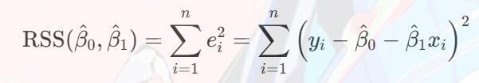
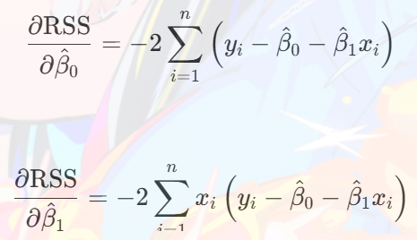
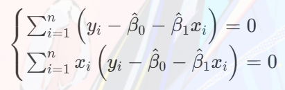
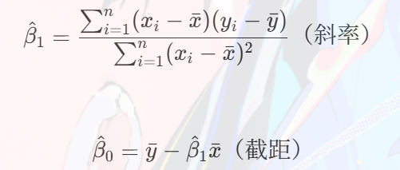

---
title: 机器学习笔记
date: 2025-09-30 20:00:00
tags:
  - 算法
  - Python
---  
  
  
  
  
  
  
  
# 机器学习
  
## 目录
- [机器学习](#机器学习)
  - [目录](#目录)
  - [线性回归](#线性回归)
    - [一元线性回归](#一元线性回归)
      - [算法思想](#算法思想)
      - [评价指标](#评价指标)
      - [python中的实现](#python中的实现)
      - [输出结果解读](#输出结果解读)
    - [多项式回归](#多项式回归)
      - [算法思想](#算法思想-1)
      - [代码实现](#代码实现)
    - [多元线性回归](#多元线性回归)
      - [算法思想](#算法思想-2)
      - [模型选择](#模型选择)
      - [代码实现](#代码实现-1)
  - [逻辑回归](#逻辑回归)
    - [算法思想](#算法思想-3)
    - [代码实现](#代码实现-2)
  
  
  
## 线性回归
  
[返回目录](#目录 )
  
### 一元线性回归
  
#### 算法思想
1. 找到一条曲线 **y = wx + b** ，使得能够根据自变量x 尽可能准确地预测因变量y
2. 模型最优解为
 

  
  
即调整w和b使得预测误差平方和最小
  
#### 评价指标
1. 均方误差：误差越小，模型预测效果越好
 

  
  
2. 均方根误差：误差越小，模型预测效果越好
 

  
  
3. 回归平方和：衡量​​回归模型“解释”的因变量变异程度​​（即模型通过自变量预测后，预测值与均值的差异）
 

  
  
4. 残差平方和：衡量​​回归模型“未解释”的因变量变异程度​​（即预测值与实际值的误差）
 

  
  
5. 总平方和：衡量​​因变量 y自身的总变异程度​​（即数据自然波动的大小）
 

  
  
6. 决定系数R^2^: 衡量​​回归模型对因变量变异的解释比例​​（取值范围 [0,1]）
 

  
  
实际中，R2越接近1，说明模型解释的变异越多，拟合效果越好
 
  
7. 调整后的决定系数R^2^~d~：在 R2基础上，​​惩罚“无意义的自变量加入”​​，更适合比较不同复杂度的模型
 

  
  
其中，m为样本量，d为自变量个数，本质是对自由度的惩罚
  
#### python中的实现

[回到目录](#目录)

1. 引入pandas模块，读取数据
  
~~~python
import pandas as pd
dataframe = pd.read_csv('data.csv')
~~~
  
| 方法 | 描述 | 参数说明 | 返回值 |
| --- | --- | --- | --- |
|`pandas.read_csv(filename)` | 读取csv文件 | 文件名或文件路径 | DataFrame |
|`dataframe.iloc[行索引器，列索引器]` | 获取行和列 | 行索引器(切片)：表示为 `start:stop` 即行的选择范围，当都为空时，默认选择所有行   列索引器(切片)：表示为 `start:stop` 即列的选择范围，当都为空时，默认选择所有列 | DataFrame |
|`dataframe.loc[行索引器，列索引器]`|获取行和列 | 行索引器(切片)：表示为 `start:stop` 即行的选择范围，当都为空时，默认选择所有行   列索引器(切片)：表示为 `start:stop` 即列的选择范围，当都为空时，默认选择所有列 | DataFrame |
  
2. 引入matplotlib模块，绘制图像，其中散点图为pyplot模块中的scatter()方法
  
~~~python
import matplotlib.pyplot as plt
# 绘制散点图
plt.scatter(dataframe['x'], dataframe['y'], color='red')
# 显示图像
plt.show()
~~~
  
| 方法 | 描述 | 参数说明 | 返回值 |
| --- | --- | --- | --- |
|`matplotlib.pyplot.scatter()` | 绘制数据点 | x: 数据点的横坐标列表  y: 数据点的纵坐标列表  s: 数据点的大小列表  c: 数据点的颜色列表  marker: 数据点的标记列表  cmap: 颜色映射对象  norm: 颜色映射对象  vmin: 颜色映射对象  vmax: 颜色映射对象  alpha: 数据点的透明度列表  linewidths: 数据点的线宽列表  verts: 数据点的标记列表  edgecolors: 数据点的边框颜色列表  plotnon | 无 |
|`matplotlib.pyplot.show()`|显示图|无|无|
|`matplotlib.pyplot.figure()`|创建一个新图|无|无|
  
3. 引入statsmodels模块，增加截距项，进行数据预处理
  
~~~python
import statsmodels.api as sm
# 增加截距项，即在原数据最右侧新增一列全为1的列'const'
df_const = sm.add_constant(dataframe)
# 将数据集X和y分别提取出来
X = df_const.iloc[:, :-1] # 选取除了截距项的所有列作为自变量矩阵
y = df_const['y'] # 提取因变量列作为因变量向量
~~~
  
|方法|描述|参数说明|返回值|
|---|---|---|---|
|`statsmodels.api.add_constant(dataframe)`|增加截距项，即在原数据最右侧新增一列全为1的列'const'|dataframe|增加截距项后的数据集dataframe|
|`statsmodels.api.OLS(y, X)`|建立OLS模型|y: 因变量向量 X: 自变量矩阵|OLS模型对象|
|`statsmodels.api.qqplot()`|绘制QQ图|data（必选参数）:待检验的样本数据（一维数据）  dist（可选参数）:检验分布，默认为正态分布  line（可选参数）: 绘制的参考线，默认为45度线 's'：绘制标准化分位数的参考线（适用于非标准分布）'r--'：自定义直线样式（如红色虚线）  ax（可选参数）: 绘图对象  kwargs（可选参数）:绘图参数|无|
|`statsmodels.api.graphics.plot_regress_exog()`|绘制自变量和因变量的回归图|model: OLS模型对象 exog_idx: 自变量索引 fig（可选参数）: 绘图对象 ax（可选参数）: 绘图对象 kwargs（可选参数）:绘图参数|无|
|`model.fit()`|训练模型|无|无|
|`model.predict(X)`|预测|X: 自变量矩阵|预测结果向量|
|`model.summary()`|查看模型报告|无|无|
  
4. 建立OLS模型，并训练模型，得到训练结果
  
~~~python
# 建立OLS模型，并训练模型
model = sm.OLS(y, X).fit()
# 预测
y_pred = model.predict(X)
# 查看模型报告
model.summary()
~~~
OLS即普通最小二乘法，即最小化残差平方和
实现步骤：
* RSS

* 对所有的参数β求偏导

* 令导数等于0，联立公式求解，得到所有的参数β

* 解方程组，得到参数β

  
5. 绘制QQ图
~~~python
# 绘制QQ图，用于检验残差是否服从正态分布
sm.qqplot(model.resid, line='r')
plt.show()
~~~
* 理想情况（完全拟合）
  
数据点​​严格沿参考线（如45°线）分布​​，说明样本分位数与理论分位数几乎一致，数据完全服从理论分布。
* 轻微偏离（可接受）
  
数据点整体沿参考线分布，但存在​​局部小幅偏离​​（如在尾部或中间位置有少量点偏离），可能是随机误差导致，通常认为数据近似服从理论分布。
* 显著偏离（不拟合）
  
数据点明显偏离参考线，呈现以下模式时，提示数据与理论分布存在显著差异：
  
* 尾部偏离​​：数据点在两端（低分位数或高分位数）偏离参考线（如右偏数据的右尾上翘），说明数据存在厚尾或偏态；
* ​整体偏移​​：数据点整体平行于参考线但不重合（如整体高于或低于参考线），说明数据分布的位置参数（如均值）与理论分布不同；
* ​曲线偏离​​：数据点呈曲线形态偏离参考线，说明数据分布的形状参数（如方差、峰度）与理论分布不同。
  
6. 残差分析
~~~python
# 残差分析
fig = plt.figure(figsize=(12, 8))
# 绘制残差图
fig = sm.graphics.plot_regress_exog(model, 'x', fig=fig)
~~~

#### 输出结果解读

[回到目录](#目录)

| 参数 | 描述 |
| --- | --- |
| Prob (F-statistic) | 模型F统计量的p值，用于判断整个回归模型是否显著。值越小（通常小于0.05），说明模型整体越显著，即至少有一个自变量对因变量有显著影响 |
| R-squared | 决定系数，表示模型能够解释的因变量总变异的比例。值越接近1，说明模型拟合效果越好 |
| Adj. R-squared | 调整后的决定系数，在R-squared基础上考虑了自变量个数的影响，惩罚了无意义的变量加入。值越接近1，模型越好，更适合用于比较不同复杂度的模型 |
| Skew | 残差分布的偏度，衡量残差分布的对称性。值越接近0，说明残差分布越对称，越接近正态分布。正值表示右偏，负值表示左偏。 |
| Kurtosis | 残差分布的峰度，衡量残差分布的尖锐程度。值越接近3（正态分布的峰度），说明残差分布越接近正态分布。大于3表示分布更尖锐，小于3表示分布更平坦 |
| P > \|t\| | 每个回归系数的t检验p值，用于判断单个自变量是否对因变量有显著影响。值越小（通常小于0.05），说明该自变量对因变量的影响越显著 |
| coef | 回归系数，表示自变量对因变量的影响程度和方向。系数的绝对值越大，影响越强；系数为正表示正相关，为负表示负相关。 |

### 多项式回归

[回到目录](#目录)

#### 算法思想
若有一条抛物线隐藏在数据集中，那么在模型中引入二次项或许会得到更好的拟合效果

#### 代码实现
在[第三步](#python中的实现)增加截距项那一步改进代码
~~~python
import statsmodels.api as sm
# 增加二次项
df_const = sm.add_constant(dataframe)
df_const['x_2'] = df_const['x'] ** 2
# 将数据集X和y分别提取出来 
X = df_const.loc[:, df_const.columns != 'y'] #自变量
y = df_const.loc[:, df_const.columns == 'y'] #因变量
~~~

### 多元线性回归

#### 算法思想
对于p值小于0.05的变量，我们可以认为它对于因变量具有显著影响，但我们无法排除其他因变量也有预测能力的可能，因此需考虑多个变量的组合对因变量的贡献。

#### 模型选择
* AIC(Akaike Information Criterion,赤池信息准则)
    * 定义: AIC是一种模型选择准则，用于在多个候选模型中选择最优模型
    * 计算公式: AIC = 2k - 2ln(L) 其中k是模型参数个数，L是模型的最大似然值
    * 特点:AIC在模型拟合度和复杂度之间寻求平衡值越小表示模型越好，相比于只考虑拟合优度的指标，AIC引入了对模型复杂度的惩罚项
* BIC(Bayesian Information Criterion,贝叶斯信息准则)
    * 定义: BIC是另一种模型选择准则，基于贝叶斯理论
    * 计算公式: BIC = k×ln(n) - 2ln(L)其中k是模型参数个数，n是样本量，L是模型的最大似然值
    * 特点:BIC对模型复杂度的惩罚比AIC更严格，当样本量较大时，BIC倾向于选择更简单的模型，值越小表示模型越好
* 区别
    * 惩罚程度: BIC对复杂模型的惩罚更重，特别是当样本量较大时
    * 理论基础: AIC基于信息论，BIC基于贝叶斯理论
    * 模型选择倾向: AIC可能选择较复杂的模型，BIC倾向于选择较简单的模型
    * 一致性: BIC具有一致性，当样本量趋于无穷时能选出真实模型；AIC则不具备此性质
#### 代码实现

* 引入多元线性回归api
~~~python
from statsmodels.formula.api import ols
~~~
* 构建模型
~~~python
model = ols('y ~ x1 + x2 + x3 + ...', data=dataframe).fit()
~~~
* 模型输出
~~~python
model.summary()
~~~
* 注意事项：不同于前两种线性回归，多元线性回归无需在数据集中添加截距项
* 交互项语法
~~~python
# 完整写法
model = ols('y ~ x1 + x2 + x3 + x1:x2 + x1:x3 + x2:x3 + x1:x2:x3', data=dataframe).fit()
# 等价简写形式
model = ols('y ~ x1 * x2 * x3', data=dataframe).fit()
~~~
* 多重共线性可以根据相关系数矩阵和方差膨胀因子(VIF)判断
~~~python
# 相关系数矩阵
"""corr()
- args:
  method: 计算方式
    - 'pearson':皮尔逊相关系数(默认)
    - 'kendall':肯德尔相关系数
    - 'spearman':斯皮尔曼相关系数
  min_periods: 最小样本数，默认为5
- return:
  返回一个DataFrame对象，包含相关系数矩阵
    相关系数值范围为[-1, 1]
      1: 完全正相关
      0: 无线性相关
      -1: 完全负相关
"""
corr = dataframe.corr()
# 方差膨胀因子
import statsmodels.stats.outliers_influence as oi
"""variance_inflation_factor()
- args:
  exog: 输入矩阵
  exog_idx: 输入矩阵的列索引
- tips:
  一般来说，VIF大于4，即认为存在多重共线性。
"""
vif = oi.variance_inflation_factor()
~~~

## 逻辑回归
[回到目录](#目录)
逻辑回归是一种二元分类模型，用于判断一个样本属于某一类别的概率。

### 算法思想
通过找到一条直线能够尽可能将不同类别分开
* 线性回归预测函数

   

  

* 期望的逻辑回归预测函数 即y取值为1的概率
   

  

* 这个式子存在等式左侧值域为[0, 1] 而等式右侧的值域为(-∞, ∞)
* 为了解决这个问题，我们可以将等式右侧的值域映射到[0, 1]，即**Sigmoid**函数
  
   

  

  或者，可以将等式左侧值域映射到(-∞, ∞)，即**Logit**函数
  
   

  

   

  

* 引入代价函数来量化预测值和真实值的差距，其中h(x)为预测值，y为真实值

   

  

   

  

   

  

* 拟合参数
   

  

* 梯度下降法，不断重复以下步骤
   

  

  **w_j**：表示第 j 个模型参数（权重）
  **α**：学习率（Learning Rate），控制每次更新的步长
  **∂J(w)/∂w_j**：损失函数 J(w) 对参数 w_j 的偏导数，表示在当前点处损失函数的变化率

  当梯度下降法收敛时，损失函数 J(w) 的值会最小化，即 J(w) 的导数等于 0
   

* 预测新样本
   

### 代码实现
1. 读取数据
  [banding_partial.csv数据集](../dataset/banking_partial.csv)
  ~~~python
  import pandas as pd

  # 1. 读取数据
  print("------读取数据------")
  data = pd.read_csv("./banking_partial.csv", header=0)  # header=0表示第一行是列名
  data.dropna()  # dropna() 方法删除数据中的空值
  print(data.shape)  # 查看数据集的行数和列数 返回(行数,列数)
  ~~~
  
2. 描述性分析与可视化分析
~~~python
# 2. 描述性分析与可视化分析
print("------描述性分析------")
print(data.sample(5)) # 查看数据集的前5行
print("------数据基本信息------")
print(data.info()) # 查看每个列的数据类型和缺失值个数

print("------数据可视化------")
import seaborn as sns
import matplotlib.pyplot as plt
"""figure() 方法设置绘图窗口
- args: 
    figsize: 绘图窗口的尺寸，参数为宽和高，单位为英寸
"""
plt.figure(figsize=(32, 10)) # figure() 方法设置绘图窗口，并设置绘图窗口的尺寸，参数为宽和高，单位为英寸
"""subplot() 方法创建子图，参数为行数，列数，子图编号
- args: 
    nrows: 行数
    ncols: 列数
    index: 子图编号
"""
plt.subplot(241) # 创建子图 241
"""countplot() 绘制分类变量的频数统计图
- args: 
    data: DataFrame 数据集
    x: 指定在 x 轴上显示的分类变量
    y: 指定在 y 轴上显示的分类变量（可选，与 x 互斥）
    hue: 分组变量，用不同颜色区分子组
    palette: 调色板，控制颜色方案
    order: 指定类别显示顺序
"""
sns.countplot(x = 'y', data = data, hue='y', palette='hls') # 绘制分类变量的频数统计图

plt.subplot(242) # 创建子图 242
sns.countplot(x = 'job', data = data)

plt.subplot(243)
sns.countplot(x = 'marital', data=data)

plt.subplot(244)
sns.countplot(x='default', data=data)

plt.subplot(245)
sns.countplot(x='housing', data=data)

plt.subplot(246)
sns.countplot(x='loan', data=data)

plt.subplot(247)
sns.countplot(x='poutcome', data=data)
~~~
3. 数据预处理
  1. 注意将离散变量拆分成单独的特征，即转化为哑变量
    ~~~python
    # 3. 数据预处理
    print("------数据预处理------")
    ## 1. 离散变量转换为哑变量
    """get_dummies() 方法将分类变量转换为哑变量
    - args: 
        data: DataFrame 数据集
        columns: 指定需要转换的列
    """
    data_dummies = pd.get_dummies(data, columns=['job', 'marital', 'default',  'housing', 'loan',  'poutcome'])
    print(data_dummies.columns) # 查看哑变量的列名

    ## 2. 查看哑变量结构
    """sample() 方法从数据集随机抽取指定数量的样本
    - args: 
        n: 指定要抽取的样本数量
        random_state: 指定随机数种子，保证每次运行结果一致
    """
    print("-----查看哑变量结构------")
    print(data_dummies[['loan_no','loan_unknown','loan_yes']].sample(5, random_state=42))
    ~~~
  2. 划分自变量和因变量
  3. 划分训练集与测试集
    ~~~python
    ## 3. 划分自变量和因变量
    X = data_dummies.iloc[: , 1: ] # 自变量，第二列到最后列
    y = data_dummies.iloc[: , 1] # 因变量，第一列
    ## 4. 划分训练集和测试集
    from sklearn.model_selection import train_test_split as tts
    """train_test_split() 方法划分训练集和测试集
    - args: 
        *arrays: 要分割的数据数组（通常是特征矩阵 X 和目标变量 y）
        test_size: 测试集所占比例（0-1之间）或样本数量
        train_size: 训练集所占比例（0-1之间）或样本数量
        random_state: 随机种子，确保结果可重现
        shuffle: 是否在分割前打乱数据（默认为 True）
        stratify: 分层抽样，保持各类别在训练集和测试集中的比例一致
    - return: 
        X_train: 训练集特征数据
        X_test: 测试集特征数据
        y_train: 训练集目标变量
        y_test: 测试集目标变量
    """
    X_tr, X_ts, y_tr, y_ts = tts(X, y, test_size=0.2) # X_tr为训练集自变量，X_ts为测试集自变量， y_tr为训练集因变量，y_ts为测试集因变量
    print("------查看训练集和测试集的维度------")
    print(f"训练集的维度：{X_tr.shape}，{y_tr.shape}")
    ~~~
4. 建立模型
  ~~~python
  # 4. 建立模型
  print("------建立模型------")
  from sklearn.linear_model import LogisticRegression
  """LogisticRegression() 方法创建逻辑回归模型
  逻辑回归模型：
      - 使用线性回归模型计算输入特征的线性组合：
          y = w0 + w1*x1 + w2*x2 + ... + wn*xn
      - 将线性组合结果通过Sigmoid函数（逻辑函数）转换为概率值：
          y = 1 / (1 + e^(-y))
      - 根据概率阈值（通常为0.5）进行分类决策
      
      y = 预测结果
      w0, w1, w2, ..., wn = 模型参数
      x1, x2, ..., xn = 特征变量
      e = 2.71828
      e^(-y) = 1 / (1 + e^())

  """
  model = LogisticRegression()
  """fit() 方法训练模型
  - args: 
      X: 特征矩阵
      y: 目标变量
  """
  model.fit(X_tr, y_tr)
  ~~~
5. 模型评估
~~~python
# 5. 模型评估
"""predict() 方法对测试集进行预测
- args: 
    X: 测试集特征数据
- return: 
    y_pred: 预测结果
"""

## 1. 预测并统计结果
y_pred = model.predict(X_ts)
print("------模型评估------")
"""value_counts() 方法统计变量的频数
- return: 
    Series: 统计结果
"""
print(pd.DataFrame(y_pred)[0].value_counts()) # 统计预测结果

## 2. 查看混淆矩阵
from sklearn.metrics import confusion_matrix
"""confusion_matrix() 方法计算混淆矩阵
- args: 
    y_true: 真实标签
    y_pred: 预测标签
- return: 
    array: 混淆矩阵
"""
print("------查看混淆矩阵------")
print("真负|假正")
print("---------")
print("假负|真正")
print(confusion_matrix(y_ts, y_pred)) # 混淆矩阵

## 3. 查看混淆矩阵相关评分
from sklearn.metrics import classification_report
print("------查看混淆矩阵相关评分------")
"""classification_report() 方法查看混淆矩阵相关评分
- args: 
    y_true: 真实标签
    y_pred: 预测标签
- return: 
    str: 评分结果
- tip:
    - precision: 精确度，预测为正的样本中，有多少是真正的正样本 Precision = TP / (TP + FP)
    - recall: 召回率，有多少是真正的正样本被预测为正样本 Recall = TP / (TP + FN)
    - f1-score: F1分数，取精确度和召回率的调和平均值
    - support: 支持度，样本中正样本的个数
    
    - accuracy: 准确率，预测正确的样本个数占所有样本的百分比
    - macro avg: 宏平均，对每个类别的评分求平均（Precision, Recall, F1-score）
    - weighted avg: 微平均，对每个类别的评分求平均，并乘以支持度求和
"""
print(classification_report(y_ts, y_pred))
~~~
6. 5折交叉验证
~~~python
## 4. 查看k折交叉验证计算准确率
"""k折交叉验证：
将数据集划分为K个大小相似的子集，
轮流使用其中K-1个子集作为训练集，
剩余1个子集作为验证集，
重复K次训练和验证过程。
"""
from sklearn.model_selection import cross_val_score
"""cross_val_score() 方法计算k折交叉验证的准确率

- args: 
    estimator: 模型
    X: 特征矩阵
    y: 目标变量
    cv: 交叉验证折数，通常为5或10
    scoring: 评分标准
- return: 
    array: 评分结果
"""
scores = cross_val_score(model, X, y, cv=10, scoring='accuracy')
"""mean() 方法计算平均值

- return: 
    float: 平均值
"""
print("------查看k折交叉验证计算准确率------")
print(scores.mean())
~~~

