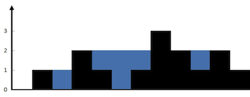
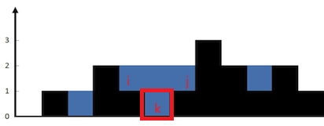

# 单调栈

## 例题一：每日温度

### 题目描述
给定一个整数数组 temperatures ，表示每天的温度，返回一个数组 answer ，其中 answer[i] 是指对于第 i 天，下一个更高温度出现在几天后。如果气温在这之后都不会升高，请在该位置用 0 来代替。

 

示例 1:

输入: temperatures = [73,74,75,71,69,72,76,73]
输出: [1,1,4,2,1,1,0,0]

示例 2:

输入: temperatures = [30,40,50,60]
输出: [1,1,1,0]

示例 3:

输入: temperatures = [30,60,90]
输出: [1,1,0]

### 解题思路
* 从前往后考虑
    * 对于当前天，我们只有在**遍历**到下一个更高温度的时候，才更新结果
    * 那么，对于下一天，如果温度比当前天高，我们需要立刻更新结果；如果温度比当前天低，我们需要**保留**下来
    * 对于下一个更高天，我们需要依次处理保存下来的天
    * 对此我们可以想到，可以利用**单调栈**来储存保留的天的索引
    * 将当前天与栈顶元素比较，如果栈顶更低，**弹出栈顶**就可以获得栈顶的索引，当前与栈顶索引差值就是所求的n天之后；否则，**入栈等待**下一个更高温度

* 从后往前考虑
    * 对于当前天，往前遍历，每一个低于当前天的，都需要处理比较，更新差值
    * 往前遍历，若遇到一个高于当前天的，则可以弹出所有栈元素，并将此天入栈
    * 此时，此天作为最大值，按照前面步骤继续处理，即可获得结果

* 无论从前往后还是从后往前，**单调栈**的核心就是及时**弹出无用数据，保持栈中元素有序**

### 代码实现
* 从前往后
    ~~~python
    class Solution:
        def dailyTemperatures(self, temperatures: List[int]) -> List[int]:
            n = len(temperatures)
            ans = [0] * n
            stack = [] # 栈用于记录标
            # 从前往后
            for i in range(n):
                t = temperatures[i]
                # 一旦当前大于栈顶元素，就要处理栈顶元素，进行弹出比较，并更新列表
                while stack and t > temperatures[stack[-1]]:
                    x = stack.pop()
                    ans[x] = i - x 
                stack.append(i)
            return ans
    ~~~

* 从后往前
    ~~~python
    class Solution:
        def dailyTemperatures(self, temperatures: List[int]) -> List[int]:
            n = len(temperatures)
            ans = [0] * n
            stack = [] # 栈用于记录标
            for i in range(-1, -n - 1, -1): # 从后往前遍历
                t = temperatures[i] # 当前下标的温度
                while stack and t >= temperatures[stack[-1]]: # 当栈中还有小于当前温度的下标，则弹出
                    stack.pop() # 弹出后栈下标向前移动，直到比当前温度更大的下标
                if stack: # 栈不为空，即当前栈顶对应温度大于当前天，需比较更新列表
                    ans[i] = stack[-1] - i # 当前与栈中最大温度下标的差值就是所求的
                stack.append(i)
            return ans
    ~~~

### 复杂度分析
* 从前往后
    * 时间复杂度：O(n)，其中 n 为 temperatures 的长度。每个元素只进栈一次，出栈一次
    * 空间复杂度：O(n)
* 从后往前
    * 时间复杂度：O(n)，原因同上
    * 空间复杂度：O(n)

## 例题二：接雨水

### 题目描述
给定 n 个非负整数表示每个宽度为 1 的柱子的高度图，计算按此排列的柱子，下雨之后能接多少雨水。

示例 1：

输入：height = [0,1,0,2,1,0,1,3,2,1,2,1]
输出：6
解释：上面是由数组 [0,1,0,2,1,0,1,3,2,1,2,1] 表示的高度图，在这种情况下，可以接 6 个单位的雨水（蓝色部分表示雨水）。 

示例 2：

输入：height = [4,2,0,3,2,5]
输出：9

### 解题思路
* 对于求解下一个比当前高或低的索引类型的问题，我们都可以使用**单调栈**来解决
* 与上一题类似，我们无论从前往后或从后往前都可以得到下一次更高的索引差
* 我们以弹出栈的索引为 k 作为底，栈顶索引 i 为左边界，当前索引 j 为右边界

* 则雨水的高度为左右边界高的较小值与底高度差值，即 **min(height[i], height[j]) - height[k]**
* 雨水的长度为 **j - i - 1**
* 故雨水容量为 **min(height[i], height[j]) - height[k] * (j - i - 1)**

### 代码实现
~~~python
class Solution:
    def trap(self, height: List[int]) -> int:
        # 遇到上一个更大更小问题，可以使用单调栈解决
        ans = 0
        stack = [] # 栈用于存放下标
        for i, h in enumerate(height):
            while stack and h > height[stack[-1]]:
                # 弹出栈顶下标的高度作为底
                bottom_h = height[stack.pop()]
                # 栈弹空了说明没有左边界，立刻跳出循环
                if not stack:
                    break
                # 栈顶为左边界
                left = stack[-1]
                # 左右边界高的较小值减去底高度，得到雨水的高度
                dh = min(height[left], h) - bottom_h
                # 累加雨水容量
                ans += dh * (i - left -1)
            stack.append(i)
        return ans
~~~

### 复杂度分析
* 时间复杂度：O(n)，其中 n 为 height 的长度。每个元素进栈一次，出栈一次
* 空间复杂度：O(n)
